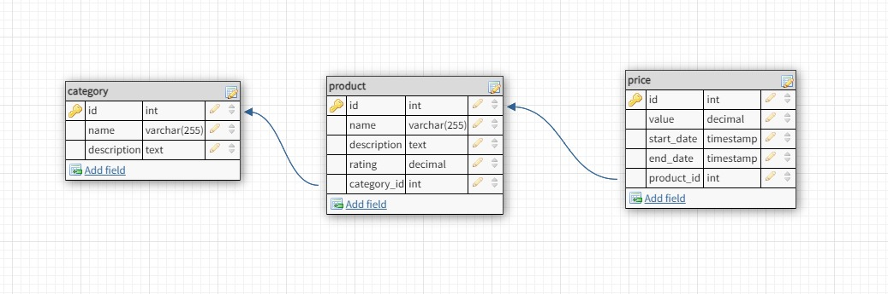

# Store Management Tool

## Description
This project is a store management tool designed to facilitate the handling of products and categories within a store. It provides a set of RESTful APIs to manage categories and products, allowing users to add, retrieve, and update information efficiently.

## Technologies
- **Spring Boot**: For creating the web application.
- **Hibernate**: For object-relational mapping.
- **Java Persistence API (JPA)**: For database interaction.
- **Maven**: For dependency management and build automation.
- **Unit Testing (JUnit)**: For ensuring code quality and correctness.

## Features
- **Category Management**: Add new categories, retrieve all categories, and find categories by name.
- **Product Management**: Add new products, update current product prices, retrieve all products, and find products by name.

## Installation and Setup
1. **Prerequisites**: Ensure you have Java and Maven installed on your machine.
2. **Clone the Repository**: git clone https://github.com/biancapaun/store-management.git
3. **Build the Project**: mvn clean install
4. **Run the Application**: mvn spring-boot:run

## Usage
After starting the application, the following endpoints are available:
- **Categories**:
- Add Category: `POST /categories`
- Get All Categories: `GET /categories`
- Get Category by Name: `GET /categories/{name}`
- **Products**:
- Add Product: `POST /products/add`
- Update Current Price: `PUT /products/{productId}/prices/{priceId}/make-current`
- Get All Products: `GET /products`
- Get Product by Name: `GET /products/{name}`

## Database Schema
Below is the database schema diagram for the Store Management Tool, illustrating the relationships between different entities:

This schema includes key tables such as `category`, `product` and `price` and shows the relationships between them.

### Category and Product:
There is a one-to-many relationship between category and product. This means that one category can have multiple products. Each product is associated with one category.

### Product and Price:
There is a one-to-many relationship between product and price. A single product can have multiple prices over time, which allows you to track the price history of a product.
The price table also includes start_date and end_date fields, which likely represent the validity period of a given price. A price is considered valid (or current) from its start_date until its end_date.

